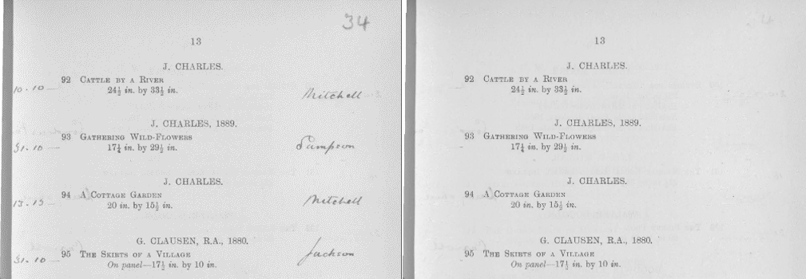

# Annotation segmentation and removal 


Removes the handwriting detected by [Synthesis in Style](https://github.com/hendraet/synthesis-in-style) by using the [LBAM inpainting model](https://github.com/Vious/LBAM_Pytorch).

## Setup

Make sure you have the synthesis-in-style lightning files in ```/final_application/synthesis_in_style_lightning``` 
before installing it locally via git submodule.
They can be copied from [here](https://github.com/adbu42/synthesis-in-style-lightning/tree/training_loop_to_lighning).
The requirements can be installed via pip and the requirements.txt file. 
Alternatively, you can use the docker image "docker://hendraet/synthesis-in-style:cuda-11.1".
Weights can be downloaded from [here](https://drive.google.com/file/d/1O_bImshs5KXloh2Nd05TzmiQIqIlJw0i/view?usp=sharing) and [here](https://drive.google.com/file/d/19daBLbYazgU6q2EaEdHudJqrkWSWYlqf/view?usp=sharing).


## Files:  

### fill_handwriting_with_background.py: 

Removes the handwriting from documents by replacing the handwriting with the mean value of the document.  
Usage: 
```
fill_handwriting_with_background.py --input-dir "directory of the documents with handwriting" --output-dir "output directory"
```

### remove_handwriting.py 

Removes the handwriting from documents by replacing the handwriting with the ouput of LBAM.  
Usage: 
```
remove_handwriting.py --input-dir "directory of the documents with handwriting" --output-dir "output directory"
```

### get_pnsr_and_ssim.py 

Outputs the pnsr, ssim, mse and l1-loss between two direcories with documents. Both directories should contain images. 
The script only compares images which have the same name in both directories. 
The ground truth and the removed-handwriting image should both have the same resolution and size.
Usage: 
```
get_pnsr_and_ssim.py --ground-truth "directory with the ground-truth images" --removed-handwriting "directory with the inpainted images"
```

## Acknowledgments 

Codebase taken and adapted from:
```
@inproceedings{xie2019image,
  title={Image inpainting with learnable bidirectional attention maps},
  author={Xie, Chaohao and Liu, Shaohui and Li, Chao and Cheng, Ming-Ming and Zuo, Wangmeng and Liu, Xiao and Wen, Shilei and Ding, Errui},
  booktitle={Proceedings of the IEEE/CVF International Conference on Computer Vision},
  pages={8858--8867},
  year={2019}
}

@article{bartz2021synthesis,
  title={Synthesis in Style: Semantic Segmentation of Historical Documents using Synthetic Data},
  author={Bartz, Christian and R{\"a}tz, Hendrik and Yang, Haojin and Bethge, Joseph and Meinel, Christoph},
  journal={arXiv preprint arXiv:2107.06777},
  year={2021}
}
```
